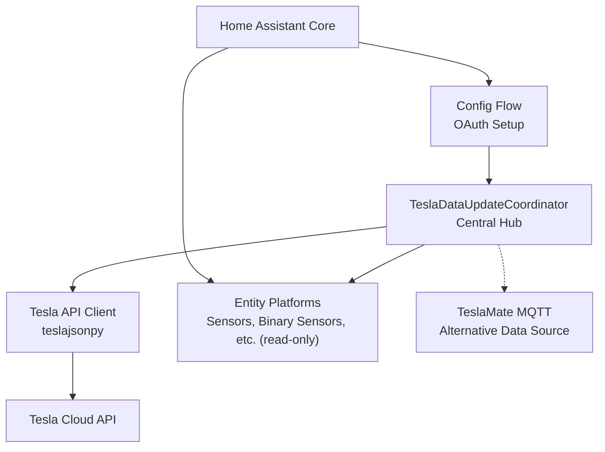
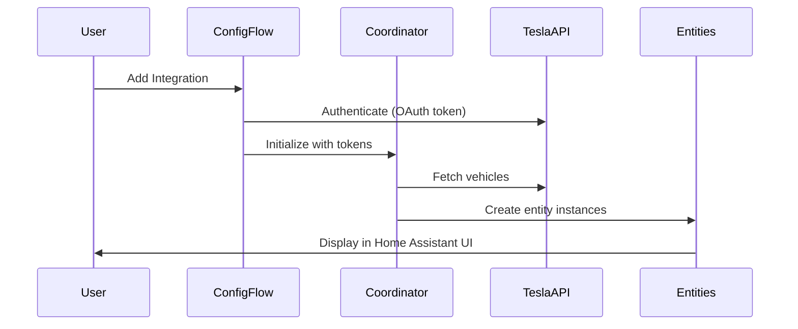
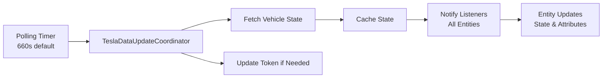
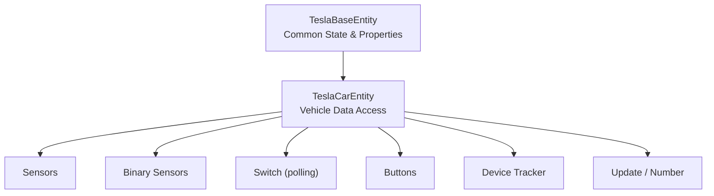
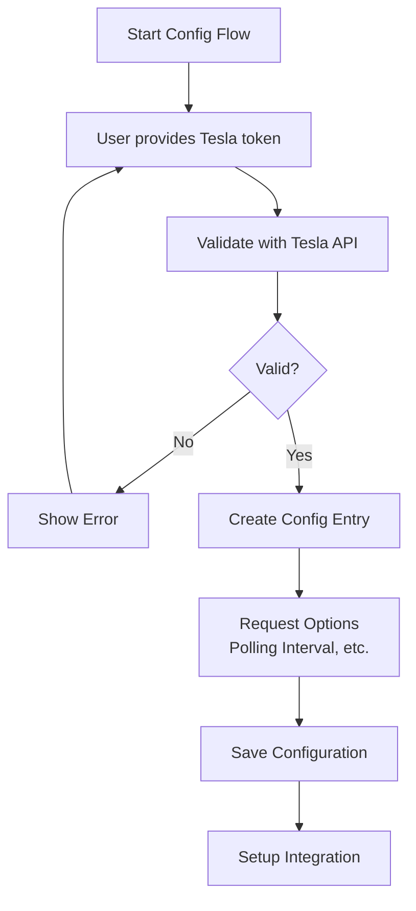
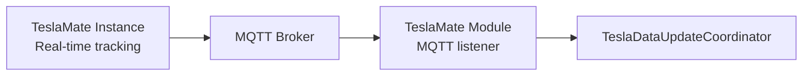
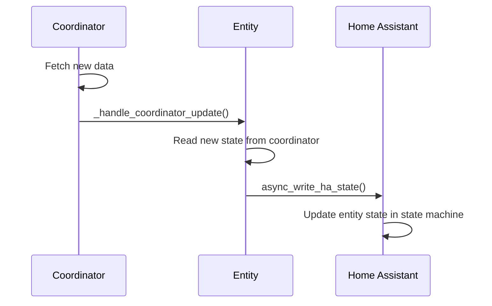
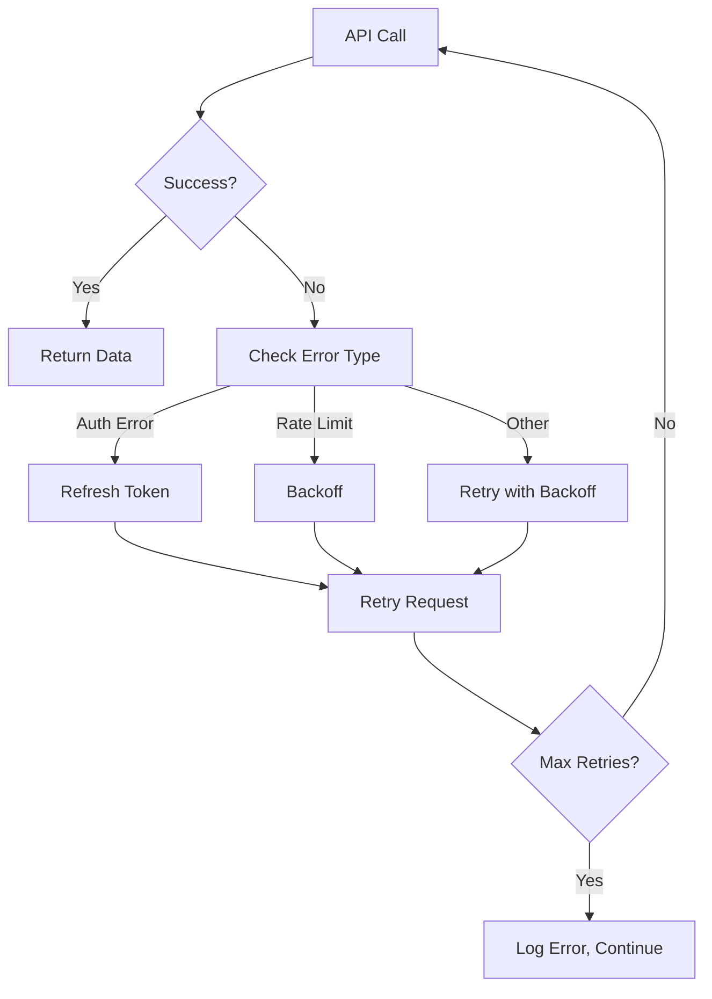

# Tesla Custom Integration - System Architecture

## High-Level System Design

The Tesla Custom Integration follows the **Data Coordinator Pattern** with **Cloud Polling Strategy**, implemented within Home Assistant's async entity framework.



## Architecture Layers

### 1. Setup & Configuration Layer

**Entry Point**: `async_setup()` and `async_setup_entry()`



**Key Functions**:

- `async_setup()` - Platform initialization (register services, set up coordinator)
- `async_setup_entry()` - Per-config-entry setup (create entities, start polling)
- `async_unload_entry()` - Clean up integration (stop polling, remove entities)

### 2. Data Coordination Layer

**Core Class**: `TeslaDataUpdateCoordinator`

Responsibilities:

- Manage API client lifecycle and authentication tokens
- Coordinate polling of all registered vehicles
- Handle vehicle wake-up/sleep logic to minimize battery drain
- Cache vehicle state data
- Distribute updates to all listening entities
- Implement exponential backoff on API failures
- Support optional TeslaMate MQTT sync as alternative to polling



**Key Methods**:

- `_async_update_data()` - Fetch latest state from Tesla API
- `async_update_listeners_debounced()` - Notify entities of state changes
- `_async_update_vehicles()` - Fetch and cache all vehicle states
- `async_remove_config_entry_device()` - Handle device removal

### 3. Entity Layer

**Base Classes**: `TeslaBaseEntity`, `TeslaCarEntity`

The entity layer implements Home Assistant entity framework patterns for different domains:



**Entity Lifecycle**:

1. Created during `async_setup_entry()`
2. Registered with Home Assistant entity registry
3. Receive updates from `TeslaDataUpdateCoordinator`
4. Update their state in Home Assistant state machine
5. Removed during `async_unload_entry()`

**Platform Modules** (one per entity domain, all read-only):

- `sensor.py` - Numeric and text state values (28 classes)
- `binary_sensor.py` - On/off state indicators (23 classes)
- `switch.py` - Local polling toggle only (1 class)
- `button.py` - Wake up and force data update (2 classes)
- `device_tracker.py` - Location tracking (2 classes)
- `update.py` - Software version tracking (read-only)
- `number.py` - TeslaMate ID (numeric car id for TeslaMate MQTT syncing)

Sending commands to the vehicle requires Tesla's signed vehicle-command
protocol, which this integration does not use. Where the corresponding state is
readable it is exposed via sensors/binary sensors.

Each platform implements `async_setup_entry()` to create and register its entities.

### 4. Configuration Layer

**File**: `config_flow.py` - Implements Home Assistant config flow UI



**Key Components**:

- `TeslaConfigFlow` - Main flow handler
- `OptionsFlowHandler` - Options configuration
- Async validation of credentials
- Token refresh and persistence
- Support for multiple accounts

### 5. Support Integrations

#### TeslaMate MQTT Integration (`teslamate.py`)

Optional alternative to polling - syncs data from TeslaMate via MQTT:



**Benefits**:

- Real-time updates without frequent polling
- Reduced battery drain
- Syncs location, charging state, climate state
- Works alongside or instead of cloud polling

#### Services (`services.py`)

Custom services for Home Assistant automations:

- `set_update_interval` - Change polling frequency at runtime
- `async_call_tesla_service` - Generic Tesla API command wrapper

## Data Flow Patterns

### Polling Cycle

```
1. Timer fires (polling_interval seconds)
2. TeslaDataUpdateCoordinator._async_update_data() called
3. Fetch all vehicles from Tesla API
4. Cache new state in coordinator
5. Notify all subscribed entities
6. Entities update their Home Assistant state
7. Wait for next polling interval
```

**Sleep Optimization**:

- Coordinator tracks vehicle sleep state
- Skips polling for sleeping vehicles to save battery
- Respects user preference: wake on start or let sleep
- Configurable polling policy

### Entity Update Cycle



### Read-Only Actions

As of the current release the integration does not send commands to the
vehicle. The only actions available do not require Tesla's signed
vehicle-command protocol:

```
1. User presses "Wake Up" or "Force Data Update" button (or toggles polling)
2. Entity calls coordinator (wake_up / force refresh only)
3. Coordinator polls for the latest state
4. Entity state updated in Home Assistant
```

> Commands such as lock/unlock, climate control, opening the trunk/frunk/
> windows and charge start/stop are not available because they require a
> signing certificate this integration does not use.

## Key Design Patterns

### 1. Data Coordinator Pattern

- Centralized data fetching and caching
- Single API client manages all connections
- Automatic retry and backoff
- Listeners notified of updates
- Reduces API calls and improves responsiveness

### 2. Entity Framework Integration

- All entities inherit from Home Assistant entity classes
- Async/await throughout for non-blocking operations
- State machine integration for persistence
- Unique IDs for device tracking
- Device grouping by vehicle

### 3. Async/Await Pattern

- Non-blocking I/O for API calls
- Concurrent polling of multiple vehicles
- Timeout handling with `async-timeout`
- Exception handling and logging

### 4. Configuration Entry System

- Credentials stored securely in Home Assistant config
- Per-entry setup and teardown
- Options flow for user configuration
- Device/entity registry updates

## Error Handling & Resilience

### API Error Handling



**Patterns**:

- Exponential backoff on transient failures
- Token refresh on auth errors
- Graceful degradation if API unavailable
- Detailed logging for debugging

### Vehicle Sleep Logic

- Coordinator monitors vehicle sleep state
- Doesn't actively wake vehicles during polling
- Respects user configuration for wake behavior
- Vehicles wake naturally on commands or user action

## Home Assistant Integration Points

### Entity Framework

- Inherits from `RestoreEntity` for state persistence
- Uses `CoordinatorEntity` for automatic update handling
- Registers with entity and device registries
- Follows unique ID conventions

### State Machine

- Entity state stored in Home Assistant state machine
- Attributes for additional data (e.g., vehicle odometer)
- Binary entities for on/off indicators
- Numeric entities for sensors and controls

### Config Entry System

- One config entry per Tesla account
- Supports multiple accounts (multiple entries)
- Options flow for configuration changes
- Device and entity discovery

### Services

- Custom services for Tesla-specific commands
- Available for automations and scripts
- Async/await for non-blocking execution

### Device & Entity Registry

- Vehicles as devices
- Entities grouped by device
- Supports device removal/grouping
- Unique identifiers for stability

## Technology Stack Integration

### Home Assistant

- `homeassistant` package for entity/device/config entry APIs
- Async patterns and event bus
- Logging and notification systems

### teslajsonpy Library

- OAuth 2.0 authentication
- Tesla API endpoint abstractions
- Vehicle data structures
- Read-only vehicle data retrieval (state, charge, climate, location)

### asyncio

- Concurrent operations (multiple vehicles)
- Non-blocking I/O for HTTP requests
- Event-driven architecture

### Python 3.13+

- Type hints throughout codebase
- Async/await syntax
- Modern Python features

## Deployment Model

The integration runs within Home Assistant process:

- Single coordinator instance per config entry
- Entities created and managed by Home Assistant
- Polling runs as background task
- No external services or sidecars required

---

**Key Takeaway**: The architecture prioritizes responsive real-time updates with minimal battery drain through intelligent polling, while maintaining clean separation between configuration, coordination, and entity layers per Home Assistant conventions.
