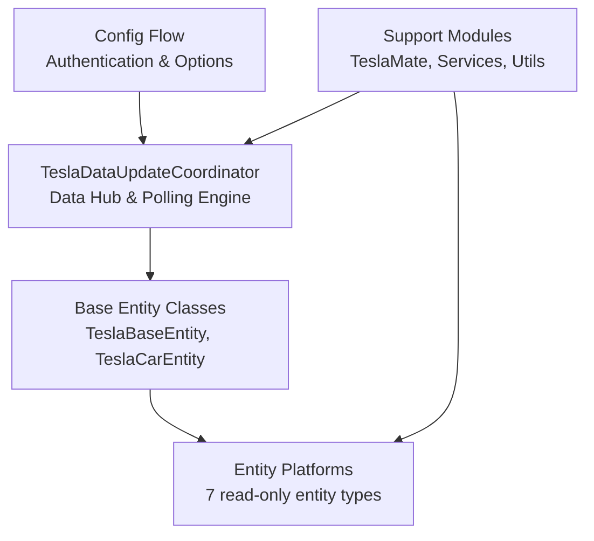

# Tesla Custom Integration - Components

## Core Components Overview



---

## 1. Core Coordinator: TeslaDataUpdateCoordinator

**File**: `custom_components/tesla_extended/__init__.py`  
**Class**: `TeslaDataUpdateCoordinator`  
**Base**: `DataUpdateCoordinator` (Home Assistant)  
**Responsibility**: Central hub for all data fetching, caching, and distribution

### Key Responsibilities

1. **API Client Management**
   - Initialize and maintain Tesla API client (from teslajsonpy)
   - Handle OAuth token refresh
   - Persist tokens to Home Assistant storage

2. **Data Fetching & Caching**
   - Poll all vehicles at configured interval (default: 660 seconds)
   - Cache latest state to avoid redundant API calls
   - Track vehicle sleep state and wake-up status

3. **Update Distribution**
   - Notify all subscribed entities of state changes
   - Implement debouncing to avoid rapid re-updates
   - Provide `async_update_listeners_debounced()` hook

4. **Error Handling**
   - Implement exponential backoff on API failures
   - Handle token refresh on auth errors
   - Log errors for debugging

5. **Vehicle Discovery**
   - Fetch list of associated vehicles on setup
   - Create Home Assistant devices and entities

### Key Methods

| Method                               | Purpose                                             |
| ------------------------------------ | --------------------------------------------------- |
| `_async_update_data()`               | Fetch latest vehicle states from Tesla API          |
| `_async_update_vehicles()`           | Get all vehicles' current state                     |
| `async_update_listeners_debounced()` | Notify listening entities after debounce            |
| `async_remove_config_entry_device()` | Handle device removal from registry                 |
| `_async_close_client()`              | Cleanup API client on shutdown                      |
| `_async_save_tokens()`               | Persist OAuth tokens to storage                     |

### Data State Structure

```python
# Coordinator maintains cached state:
coordinator.data = {
    "vehicles": [
        {
            "id": "vehicle_id",
            "state": "online",  # or "asleep"
            "response": {  # Latest API response
                "id": ...,
                "state": ...,
                "charge_state": {...},
                "climate_state": {...},
                # ... all vehicle properties
            }
        },
        # ... more vehicles
    ]
}
```

---

## 2. Base Entity Classes

**File**: `custom_components/tesla_extended/base.py`

### Class Hierarchy

```
TeslaBaseEntity (Common functionality)
└── TeslaCarEntity (Vehicle-specific)
```

### TeslaBaseEntity

**Base**: Home Assistant entity framework  
**Responsibility**: Common functionality for all Tesla entities

**Key Properties**:

- `coordinator` - Reference to TeslaDataUpdateCoordinator
- `device_identifier()` - Helper to create unique device IDs
- `assumed_state` - Whether entity can't directly sense state

**Key Methods**:

- `_handle_coordinator_update()` - Called when coordinator updates
- `async_added_to_hass()` - Register listener when entity added
- `async_will_remove_from_hass()` - Cleanup on removal

### TeslaCarEntity

**Extends**: `TeslaBaseEntity`  
**Responsibility**: Vehicle-specific functionality

**Key Properties**:

- `vehicle` - The vehicle object from coordinator data
- `vin` - Vehicle VIN (unique identifier)
- `car_name` - User-friendly vehicle name
- `device_info` - Device registration info

**Usage**: All vehicle-related entities inherit from this

**Example Subclasses**:

- `TeslaCarBattery` - Battery level sensor
- `TeslaCarClimateOn` - Climate on/off binary sensor
- `TeslaCarPolling` - Local polling switch

---

## 3. Entity Platforms (Domain Modules)

### Entity Type Distribution

```
Sensors                        28 classes
└── Battery, range, charger rate/energy/power, charge limit, charging amps,
    charger current/voltage, temperature (inside/outside), driver/passenger
    temp setting, cabin overheat protection, climate keeper mode, heated
    steering wheel level, per-seat heater, speed, power, heading, odometer,
    shift state, center display state, TPMS, time to charge complete, arrival
    time, distance to arrival, data update time, polling interval

Binary Sensors                 23 classes
└── Charging, online, asleep, user present, parking brake, charger connection,
    doors, windows, doors lock, charge port latch, charge port door, frunk,
    trunk, sunroof, sentry mode, valet mode, climate on, preconditioning,
    battery heater, front/rear defroster, scheduled charging, scheduled
    departure

Switch                         1 class
└── Polling (local only; does not command the vehicle)

Buttons                        2 classes
└── Wake Up, Force Data Update

Device Tracker                 2 classes
└── Car Location, Route Destination

Update                         1 class
└── Software Version Status (read-only)

Number                         1 class
└── TeslaMate ID (numeric car id for TeslaMate MQTT syncing)
```

Total: 28 + 23 + 1 + 2 + 2 + 1 + 1 = 58 entity classes across 7 platforms.

### Sensor Platform (`sensor.py`)

**Implements**: Numeric and text state values

**Key Classes** (28 total):

- `TeslaCarBattery` - Battery percentage
- `TeslaCarRange` - Estimated range
- `TeslaCarChargerPower` - Current charging power
- `TeslaCarChargerRate` - Charging rate (km/hour)
- `TeslaCarEnergyAdded` - Energy added this session
- `TeslaCarChargeLimit` - Charge limit percentage
- `TeslaCarChargingAmps` - Charging amps
- `TeslaCarChargerCurrent` - Charger actual current
- `TeslaCarChargerVoltage` - Charger voltage
- `TeslaCarTemp` - Inside/outside temperature
- `TeslaCarDriverTempSetting` - Driver target temperature
- `TeslaCarPassengerTempSetting` - Passenger target temperature
- `TeslaCarCabinOverheatProtection` - Cabin overheat protection mode
- `TeslaCarClimateKeeperMode` - Climate keeper mode
- `TeslaCarHeatedSteeringWheelLevel` - Heated steering wheel level
- `TeslaCarSeatHeater` - Per-seat heater level (diagnostic)
- `TeslaCarSpeed` - Current speed
- `TeslaCarPower` - Drive/regen power
- `TeslaCarHeading` - Heading
- `TeslaCarOdometer` - Total miles/km driven
- `TeslaCarArrivalTime` - Route arrival time

> All sensors are read-only.

**Pattern**:

```python
class TeslaSensorClass(TeslaCarEntity, SensorEntity):
    @property
    def native_value(self):
        # Extract value from coordinator data
        return self.vehicle["response"]["..."]["value"]

    @property
    def native_unit_of_measurement(self):
        return UnitOfXXX.UNIT

    @property
    def device_class(self):
        return SensorDeviceClass.XXX

    @property
    def icon(self):
        return "mdi:icon-name"
```

### Binary Sensor Platform (`binary_sensor.py`)

**Implements**: On/off state indicators

**Key Classes** (23 total):

- `TeslaCarOnline` - Vehicle online status
- `TeslaCarAsleep` - Vehicle sleep state
- `TeslaCarCharging` - Actively charging
- `TeslaCarChargerConnection` - Charger physically connected
- `TeslaCarDoors` - Door open/closed
- `TeslaCarWindows` - Window open/closed
- `TeslaCarDoorsLock` - Doors locked/unlocked
- `TeslaCarChargePortLatch` - Charge port latch engaged
- `TeslaCarChargePortDoor` - Charge port door open/closed
- `TeslaCarFrunk` - Frunk open/closed
- `TeslaCarTrunk` - Trunk open/closed
- `TeslaCarSunRoof` - Sunroof open/closed
- `TeslaCarSentryMode` - Sentry mode on/off
- `TeslaCarValetMode` - Valet mode on/off
- `TeslaCarClimateOn` - Climate on/off
- `TeslaCarPreconditioning` - Preconditioning active
- `TeslaCarBatteryHeater` - Battery heater on (diagnostic)
- `TeslaCarFrontDefroster` / `TeslaCarRearDefroster` - Defroster on (diagnostic)
- `TeslaCarScheduledCharging` / `TeslaCarScheduledDeparture` - Scheduling state
- `TeslaCarUserPresent` - Parking brake / user present

> All binary sensors are read-only.

**Pattern**:

```python
class TeslaBinarySensorClass(TeslaCarEntity, BinarySensorEntity):
    @property
    def is_on(self):
        # Return boolean state
        return self.vehicle["response"]["..."]["bool_value"]

    @property
    def device_class(self):
        return BinarySensorDeviceClass.XXX
```

### Switch Platform (`switch.py`)

**Implements**: Local polling toggle (does not command the vehicle)

**Key Class** (1 total):

- `TeslaCarPolling` - Enable/disable polling for the vehicle (local only)

**Pattern**:

```python
class TeslaCarPolling(TeslaCarEntity, SwitchEntity):
    async def async_turn_on(self, **kwargs):
        # Enables local polling only; no command sent to the vehicle
        self.coordinator.controller.enable_polling(self.vin)

    async def async_turn_off(self, **kwargs):
        self.coordinator.controller.disable_polling(self.vin)

    @property
    def is_on(self):
        return self.coordinator.controller.is_car_polling_enabled(self.vin)
```

### Button Platform (`button.py`)

**Implements**: One-time action triggers (read-only actions only)

**Key Classes** (2 total):

- `TeslaCarWakeUp` - Wake sleeping vehicle (does not require signing)
- `TeslaCarForceDataUpdate` - Force a data refresh of cached data

**Pattern**:

```python
class TeslaCarWakeUp(TeslaCarEntity, ButtonEntity):
    async def async_press(self) -> None:
        # Wake up / force refresh do not require command signing
        await self.coordinator.controller.wake_up(self.vin)
        await self.coordinator.async_request_refresh()
```

### Device Tracker Platform (`device_tracker.py`)

**Implements**: Location and navigation tracking

**Key Classes**:

- `TeslaCarLocation` - Current vehicle location (lat/lon)
- `TeslaCarDestinationLocation` - Active route destination

**Pattern**:

```python
class TeslaLocationClass(TeslaCarEntity, TrackerEntity):
    @property
    def latitude(self):
        return self.vehicle["response"]["drive_state"]["latitude"]

    @property
    def longitude(self):
        return self.vehicle["response"]["drive_state"]["longitude"]

    @property
    def source_type(self):
        return SourceType.GPS
```

### Update Platform (`update.py`)

**Implements**: Software version tracking

**Key Class**: `TeslaCarUpdate`

**Capabilities**:

- Track available software updates
- Show update status (available, scheduled, downloading, installing) and
  install progress

> **Read-only**: `supported_features` exposes only
> `UpdateEntityFeature.PROGRESS`; there is no `async_install` because
> installing an update requires Tesla's signed vehicle-command protocol.

### Number Platform (`number.py`)

**Implements**: Numeric configuration input

**Key Class**: `TeslaCarTeslaMateID`

**Purpose**: Store/retrieve the numeric TeslaMate car id used for TeslaMate MQTT syncing

---

## 4. Configuration System

**File**: `custom_components/tesla_extended/config_flow.py`  
**Classes**: `TeslaConfigFlow`, `OptionsFlowHandler`

### TeslaConfigFlow

**Purpose**: Handles user authentication and config entry creation

**Flow Steps**:

1. `async_step_user()` - Initial form requesting Tesla token
2. `async_step_credentials()` - Alternative token input method
3. `async_step_reauth()` - Reauthenticate if token expires
4. `async_step_import()` - Legacy config import

**Validation**:

- `validate_input()` - Test token with Tesla API
- Prevents duplicate entries for same account
- Stores tokens securely in Home Assistant

### OptionsFlowHandler

**Purpose**: Configure integration options after setup

**Options**:

- `polling_interval` - Seconds between updates (default: 660)
- `sentry_scan_interval` - Polling interval (seconds, min 5, default 660) used while sentry mode is active on any vehicle
- `wake_on_start` - Wake sleeping cars on HA startup
- `polling_policy` - When to allow cars to sleep
- `teslamate_enabled` - Enable TeslaMate sync

---

## 5. Support Modules

### TeslaMate Integration (`teslamate.py`)

**Class**: `TeslaMate`  
**Purpose**: Sync data from TeslaMate via MQTT as alternative to polling

**Key Methods**:

- `enable()` - Start MQTT listening
- `watch_cars()` - Subscribe to vehicle topics
- `async_handle_new_data()` - Process incoming MQTT messages
- `update_car_state()` - Update coordinator with new data

**Benefits**:

- Real-time updates without polling
- Reduced battery drain
- Works alongside cloud polling

### Services (`services.py`)

**Purpose**: Custom services for Home Assistant automations

**Services**:

- `set_update_interval` - Change polling interval at runtime
- `async_call_tesla_service` - Generic Tesla API command wrapper

**Usage**:

```yaml
service: tesla_extended.set_update_interval
data:
  config_entry_id: "..."
  interval: 300
```

### Utilities (`util.py`)

**Purpose**: Helper functions

**Functions**:

- `create_tesla_ssl_context()` - Create SSL context for API requests

---

## Component Responsibility Matrix

| Component     | Setup | Config | Polling | Dispatch |
| ------------- | ----- | ------ | ------- | -------- |
| Coordinator   | ✓     | ✓      | ✓       | ✓        |
| Base Entities | ✓     | ✓      | -       | ✓        |
| Platforms     | ✓     | -      | -       | -        |
| Config Flow   | -     | ✓      | -       | -        |
| TeslaMate     | -     | -      | ✓       | ✓        |
| Services      | -     | -      | -       | -        |

> No component sends commands to the vehicle; the integration is
> read-only apart from wake up, force data update and the local polling switch.

---

**Summary**: The component architecture cleanly separates data coordination (TeslaDataUpdateCoordinator), configuration (ConfigFlow), entity types (platform modules), and support integrations, following Home Assistant patterns and Python best practices.
