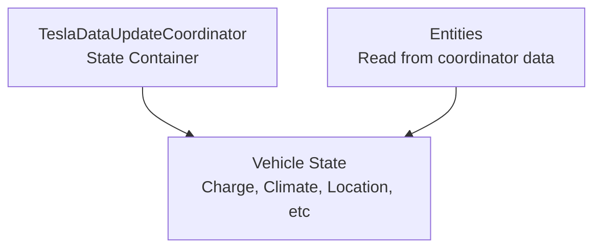

# Tesla Custom Integration - Data Models

## Data Model Overview



---

## 1. Coordinator Data State

**Stored in**: `TeslaDataUpdateCoordinator.data`

### Root Structure

```python
coordinator.data: Dict[str, Any] = {
    "vehicles": List[Dict],     # All associated vehicles
    "last_update": datetime,    # Timestamp of last successful update
}
```

### Vehicles List Entry

```python
{
    "id": str,                  # Tesla vehicle ID (unique per account)
    "vin": str,                 # Vehicle Identification Number
    "state": str,               # "online", "asleep", "offline", etc
    "response": Dict[str, Any], # Latest Tesla API response (vehicle_data)
    "updated_at": datetime,     # When this entry was last updated
}
```

---

## 2. Vehicle State Schema

**Source**: Tesla API `vehicle_data` endpoint  
**Accessed via**: `vehicle["response"]`

### Complete Vehicle Schema

```python
vehicle_response = {
    # === IDENTITY ===
    "id": int,                          # Unique vehicle ID
    "vin": str,                         # Vehicle VIN (e.g., "5YJ...")
    "display_name": str,                # User-set display name
    "api_version": int,                 # API version
    "option_codes": str,                # Vehicle option codes

    # === VEHICLE STATE ===
    "state": str,                       # "online", "asleep", "offline"

    # === CHARGE STATE ===
    "charge_state": {
        "charging_state": str,          # "Charging", "Complete", "Stopped", "Disconnected"
        "battery_heater_on": bool,
        "battery_level": int,           # 0-100, percentage
        "usable_battery_level": int,    # 0-100, usable percentage
        "charge_limit_soc": int,        # 0-100, set limit
        "charge_energy_added": float,   # kWh added in session
        "charge_miles_added_ideal": float,
        "charge_miles_added_rated": float,
        "charge_rate": float,           # km/h or miles/h
        "charger_phases": int | None,   # 1, 2, or 3 phase
        "charger_pilot_current": int,   # Amps
        "charger_actual_current": int,  # Amps
        "charger_power": int,           # kW
        "charger_voltage": int,         # Volts
        "conn_charge_cable": str,       # Connector type
        "est_battery_range": float,     # km or miles
        "ideal_battery_range": float,   # km or miles
        "range": float,                 # km or miles
        "time_to_full_charge": float,   # hours
        "charge_port_door_open": bool,
        "charge_port_latch": str,       # "Engaged", "Disengaged"
        "scheduled_charging_pending": bool,
        "scheduled_charging_start_time": int | None,
        "user_charge_enable_request": bool | None,
    },

    # === CLIMATE STATE ===
    "climate_state": {
        "inside_temp": float | None,    # Celsius
        "outside_temp": float | None,   # Celsius
        "target_temp": float,           # Celsius
        "climate_keeper_mode": str,     # "off", "on", "dog", "camp"
        "hvac_auto_fan_speed": int | None,
        "is_climate_on": bool,
        "is_preconditioning": bool,
        "is_defrosting": bool,
        "fan_status": int | None,       # 0-6
        "left_temp_direction": int | None,
        "right_temp_direction": int | None,
        "max_avail_temp": float,        # Max settable temp
        "min_avail_temp": float,        # Min settable temp
        "side_mirror_heaters": bool | None,
        "wiper_blade_heater": bool,
    },

    # === VEHICLE STATE (DOORS, WINDOWS, LOCKS) ===
    "vehicle_state": {
        "is_user_present": bool,
        "locked": bool,

        # Door states (0=closed, >0=open)
        "fd_window": int,               # Front driver window
        "rd_window": int,               # Rear driver window
        "fp_window": int,               # Front passenger window
        "rp_window": int,               # Rear passenger window

        # Door open status (0=closed, 1=open)
        "df": int,                      # Driver front
        "dr": int,                      # Driver rear
        "pf": int,                      # Passenger front
        "pr": int,                      # Passenger rear
        "ft": int,                      # Frunk (front trunk)
        "rt": int,                      # Rear trunk

        # Charge port
        "charge_port_latch": str,       # "Engaged", "Disengaged"
        "charge_port_door_open": bool,

        # Sunroof
        "sun_roof_installed": bool | None,
        "sun_roof_percent_open": int | None,
        "sun_roof_state": str | None,

        # Security
        "sentry_mode": bool,
        "is_user_present": bool,

        # Seats
        "seat_heater_left": int | None,  # 0-3 (off to high)
        "seat_heater_right": int | None,
        "seat_heater_rear_center": int | None,
        "seat_heater_rear_left": int | None,
        "seat_heater_rear_right": int | None,

        # Parking brake
        "parking_brake_on": bool,

        # Other
        "odometer": float,              # miles or km
        "front_bumper_damage": bool | None,
        "rear_bumper_damage": bool | None,
        # ... and more
    },

    # === DRIVE STATE (LOCATION & NAVIGATION) ===
    "drive_state": {
        "latitude": float,              # GPS latitude
        "longitude": float,             # GPS longitude
        "heading": int,                 # 0-359 degrees
        "gps_as_of": int,               # Unix timestamp
        "power": int,                   # kW (positive=drive, negative=regen)
        "shift_state": str | None,      # "D", "R", "N", "P"

        # Active route/navigation
        "active_route_destination": str,
        "active_route_energy_at_arrival": int | None,
        "active_route_latitude": float | None,
        "active_route_longitude": float | None,
        "active_route_miles_to_arrival": float | None,
        "active_route_minutes_to_arrival": int | None,

        # Speed & movement
        "speed": int | None,            # mph or km/h
    },

    # === SOFTWARE UPDATE ===
    "software_update": {
        "install_perc": int | None,     # 0-100
        "status": str,                  # "", "available", "scheduled", "installing", etc
        "download_perc": int | None,
        "expected_duration_sec": int | None,
        "scheduled_time_ms": int | None,
    },

    # === TIRE PRESSURE ===
    "vehicle_state": {
        # ... (nested in vehicle_state above)
    },
    "tpms_pressure": {
        "fl": float,                    # Front left (psi)
        "fr": float,                    # Front right
        "rl": float,                    # Rear left
        "rr": float,                    # Rear right
    },

    # === OTHER STATE ===
    "gui_settings": {
        "gui_distance_units": str,      # "km/hr" or "mi/hr"
        "gui_temperature_units": str,   # "C" or "F"
    },
}
```

### Vehicle State Common Values

#### State Values

```python
"state": "online" | "asleep" | "offline" | "charging"
```

#### Charging States

```python
"charging_state": "Charging" | "Complete" | "Stopped" | "Disconnected"
```

#### Shift States

```python
"shift_state": "D" | "R" | "N" | "P" | None
```

#### Climate Keeper Modes

```python
"climate_keeper_mode": "off" | "on" | "dog" | "camp"
```

#### Charge Port Latch

```python
"charge_port_latch": "Engaged" | "Disengaged" | "Engaged"
```

---

## 3. Configuration Data Model

**File**: Home Assistant config entry storage

### Config Entry Data

```python
config_entry.data = {
    "unique_id": str,                   # Usually account email
    "username": str,                    # Tesla account email
    "refresh_token": str,               # OAuth refresh token (encrypted)
}

config_entry.options = {
    "polling_interval": int,            # Seconds (default: 660)
    "wake_on_start": bool,              # Wake cars on HA startup (default: False)
    "polling_policy": str,              # "polling_policy_*" (see below)
    "teslamate_enabled": bool,          # Enable TeslaMate sync (default: False)
}
```

### Polling Policies

```python
"polling_policy": (
    "polling_policy_always" |           # Always poll
    "polling_policy_connected_only" |   # Only when cars online
    "polling_policy_conserve" |         # Minimize polling, let sleep
)
```

---

## 4. Entity Attribute Models

### Sensor Entity Attributes

```python
sensor_entity = {
    # State (value)
    "state": "42.0",                    # Latest reading

    # Attributes
    "attributes": {
        "unit_of_measurement": "°C",    # Units
        "device_class": "temperature",
        "friendly_name": "Tesla Temperature",
        "icon": "mdi:thermometer",
        "last_updated": "2024-11-15T10:30:00",

        # Entity-specific attributes
        "vehicle_name": "My Tesla",
        "vin": "5YJ...",
    }
}
```

### Binary Sensor Attributes

```python
binary_sensor_entity = {
    "state": "on" | "off",
    "attributes": {
        "device_class": "door",
        "friendly_name": "Front Door",
        "vehicle_name": "My Tesla",
    }
}
```

### Switch Attributes

```python
switch_entity = {
    "state": "on" | "off",
    "attributes": {
        "assumed_state": False,
        "friendly_name": "Polling",
        "vehicle_name": "My Tesla",
    }
}
```

> The only switch as of v5.0.0 is the local **Polling** switch; it does not
> command the vehicle.

### Removed Entity Attribute Models (v5.0.0)

> The **Climate**, **Cover** and **Lock** entities were removed in v5.0.0
> because controlling them requires Tesla's signed vehicle-command protocol.
> The underlying state is still read from the vehicle schema below and exposed
> through read-only sensors and binary sensors (e.g. `TeslaCarClimateOn`,
> `TeslaCarFrunk`/`TeslaCarTrunk`/`TeslaCarSunRoof`, `TeslaCarDoorsLock`,
> `TeslaCarChargePortLatch`).

---

## 5. Type Definitions & Validation

### Python Type Hints

```python
from typing import Dict, List, Optional, Any, Union
from datetime import datetime

# Vehicle data
VehicleData = Dict[str, Any]
VehicleResponse = Dict[str, Any]
VehicleState = Dict[str, Any]

# Configuration
ConfigData = Dict[str, str]
ConfigOptions = Dict[str, Any]

# Coordinator data
CoordinatorData = Dict[str, Union[List[VehicleData], datetime]]

# Entity data
EntityData = Dict[str, Any]
```

### Validation Schemas

```python
import voluptuous as vol
from homeassistant import config_entries

# Config entry schema
CONFIG_SCHEMA = vol.Schema({
    vol.Required("username"): cv.string,
    vol.Required("refresh_token"): cv.string,
})

# Options schema
OPTIONS_SCHEMA = vol.Schema({
    vol.Optional("polling_interval", default=660): vol.Range(min=60, max=3600),
    vol.Optional("wake_on_start", default=False): cv.boolean,
    vol.Optional("polling_policy", default="polling_policy_always"): vol.In([
        "polling_policy_always",
        "polling_policy_connected_only",
        "polling_policy_conserve",
    ]),
    vol.Optional("teslamate_enabled", default=False): cv.boolean,
})
```

---

## 6. Data Transformation & Mapping

### State Transformations

Some API responses are transformed before storage:

```python
# Raw API: state field values
raw_state = "online" | "asleep" | "offline"
# Stored as-is in coordinator.data

# Raw API: charging_state values
raw_charging = "Charging" | "Complete" | "Stopped" | "Disconnected"
# Stored as-is, entities map to Home Assistant constants

# Raw API: temperature in Celsius
raw_temp = 22.5
# Stored as-is, Home Assistant handles unit conversion per user settings
```

### TeslaMate MQTT Data Mapping

TeslaMate MQTT topics map to vehicle state fields:

```python
mqtt_topic_to_field = {
    "teslamate/cars/{car_id}/state": "state",
    "teslamate/cars/{car_id}/charge_state": "charging_state",
    "teslamate/cars/{car_id}/latitude": "latitude",
    "teslamate/cars/{car_id}/longitude": "longitude",
    "teslamate/cars/{car_id}/battery_level": "battery_level",
    # ... and many more
}
```

---

## 7. Data Lifecycle

### Update Cycle

```
1. Coordinator polling timer fires (every polling_interval seconds)
2. _async_update_data() called
3. API requests fetch vehicle responses
4. Responses cached in coordinator.data
5. async_update_listeners_debounced() called
6. Entities' _handle_coordinator_update() called
7. Entities read new data from coordinator.data
8. Entities call async_write_ha_state()
9. Home Assistant state machine updated
```

### Data Freshness

- **Polling data**: Updated at polling_interval (default 660 seconds)
- **Cached data**: Available immediately, returned on failed API calls
- **TeslaMate data**: Updated as soon as TeslaMate publishes to MQTT
- **Entity-local cache**: None (read directly from coordinator on each update)

### Data Retention

- **Coordinator data**: Kept in memory, persisted across updates
- **Home Assistant state**: Automatically persisted by state machine
- **Configuration**: Stored securely in Home Assistant config storage

---

## 8. Common Data Access Patterns

### Accessing Vehicle Data from Entity

```python
# In TeslaCarEntity subclass
battery_level = self.vehicle["response"]["charge_state"]["battery_level"]
is_charging = self.vehicle["response"]["charge_state"]["charging_state"] == "Charging"
temp = self.vehicle["response"]["climate_state"]["inside_temp"]
latitude = self.vehicle["response"]["drive_state"]["latitude"]
```

### Null Safety

```python
# Many fields are optional (None) - always check
inside_temp = self.vehicle["response"]["climate_state"].get("inside_temp")
if inside_temp is not None:
    return inside_temp
return None  # or default value
```

---

**Summary**: Data flows from Tesla API → Coordinator cache → Entities → Home Assistant State Machine, with TeslaMate MQTT as optional real-time alternative. All models follow Home Assistant entity framework conventions.
